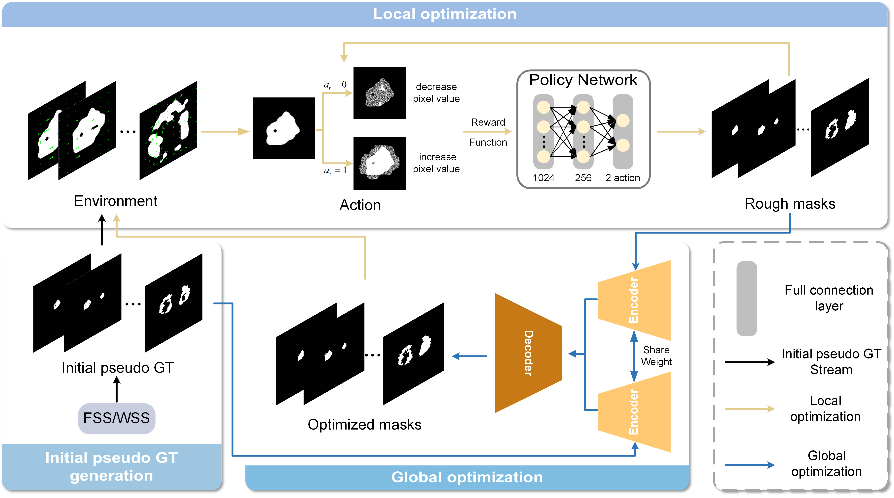

# CTSA
Overall pipeline of the proposed CTSS framework. The CTSS contains three parts: the generation of initial pseudo GT, the local optimization module, and the global optimization module. And the process represented by the black arrow is executed only once.

Framework:

Demo:

  
  

